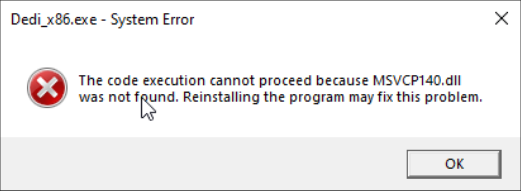
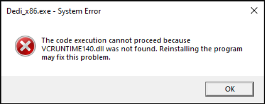
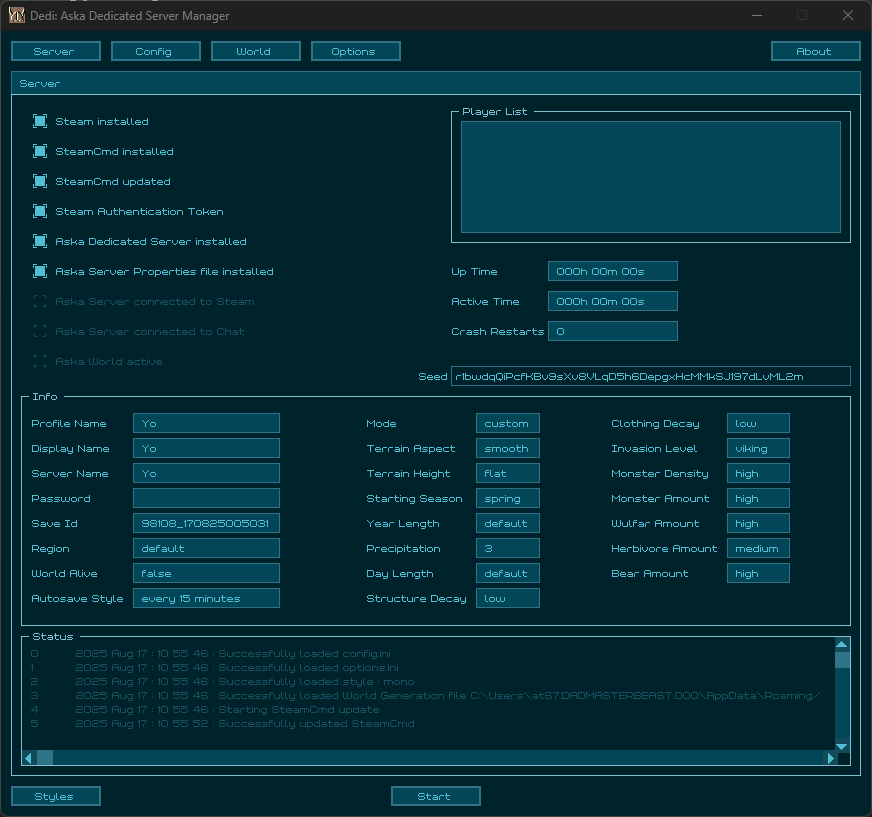

# Dedi
Is a Windows 10/11 only tool that allows for the simple installation, monitoring and control of the Aska Dedicated Server.

## Latest, V0.25
- Added ClothingDecay to "server properties.txt" handling.
- Added ClothingDecay to "worldgen" handling.

## What Dedi Does For You

- **Automatic SteamCmd setup** - No command line needed
- **Automatic server downloads** - Always the latest Aska Server version
- **Auto-restart on crashes** - Never stays down
- **Player join backups** - Rollback griefers instantly
- **Real-time monitoring** - See who's connected
- **One-click start/stop** - No batch files or commands

## Install
- Install the Aska Dedicated Server through Steam on the same PC/Laptop you will be installing Dedi on.
- Do NOT install Dedi into the same folder as your Aska Dedicated Server or the Aska game!
- Download the latest release at: https://github.com/at67/Dedi/releases 
- The zip file should contain one folder and three files:
	- styles, (folder)
	- Dedi_x64.exe, (file)
	- Dedi_x86.exe, (file)
	- viking.png, (file)
- Create a folder with at least 5 GBytes of free space, (more if you plan on using multiple servers or a large number of backup saves).
- Copy the contents of Dedi.zip into this newly created folder, eg: C:\Dedi 
	C:\Dedi\styles 
	C:\Dedi\Dedi_x64.exe 
	C:\Dedi\Dedi_x86.exe 
	C:\Dedi\viking.png 
 - If you are installing Dedi and the Aska Dedicated Server on a different PC/Laptop to your PC/Laptop that the main Aska game is installed on, then you need to do the following:
	a) You need to login to the same steam account that your purchased the main game game on.
	b) Download/install the Aska Dedicated Server.
	c) Install Dedi to this PC/Laptop, NOT to the same folder as the Aska Dedicated Server.
	d) From then on when you launch the Aska dedicated server, (through Dedi), it will login anonymously into SteamCmd using your authorisation token saved in your "server properties.txt" file to launch the actual server.
	e) You don't need multiple steam accounts and you don't need to be logged into Steam to launch the Aska Dedicated Server, (you only need to login to Steam once to download/install it).

## Usage
- Run either Dedi_x64.exe or Dedi_x86.exe depending on your OS, if it is 32bit use Dedi_x86.exe, otherwise use Dedi_x64.exe.
- If you unsure, then use Dedi_x86.exe.
- You will receive an unsigned warning from Windows, this is normal and expected, to remove this I would have to pay approximately $1000(US) per year to obtain a legitimate signed certificate.
- if you're worried even remotely about the unsigned warning then please just delete Dedi from your system.
- Dedi has been tested on Win10 and Win11, not Linux or VM's.

## Quick Start (3 Steps)

### Step 1: Install Dedi (2 minutes)
0. Install the Aska Dedicated Server through Steam on the same PC/Laptop you will be installing Dedi on. Do NOT install Dedi into the same folder as your Aska Dedicated Server or the Aska game!
1. Download from https://github.com/at67/Dedi/releases
2. Extract to a new folder (e.g., `C:\Dedi`) - **NOT in your Aska game folder**
3. Run `Dedi_x64.exe` (or `Dedi_x86.exe` for 32-bit)
4. Click through Windows security warning (normal for unsigned software)

### Step 2: Get Steam Token (3 minutes)
1. In Dedi, click **Get Token** button (opens Steam website)
2. Login to Steam, create game server account:
   - App ID: `1898300` (already filled in)
   - Memo: Any name you want (just for your reference)
3. Copy the long token string
4. Paste in Dedi **Config** tab → **Server** section → **Steam Token** field
5. Click **Generate** button

### Step 3: Install & Start (5 minutes)
1. Go to **Server** tab
2. Click **Install** - this downloads everything automatically
3. Wait for all appropriate checkmarks to turn green ✅
4. If the **Start** button is disabled, then head to Troubleshooting.
5. Click **Start**
6. Your server is running when you see "Aska Server connected to Chat" ✅

**Done!** Your server appears in Aska's multiplayer browser.

## Basic Configuration

### Server Identity
**Config** tab → **Server** section:
- **Server Name**: What players see in server browser
- **Password**: Leave empty for public, set for private
- **Region**: Choose your location

### Save Selection
- **SaveId button**: Browse to your existing Aska save
- Or start with default empty world

That's it! Advanced settings are optional.

## Server Management
[Server Management Guide](doc/Server_Management_Guide.pdf)

## Configuration Reference
[Configuration Reference](doc/Configuration_Reference.pdf)

## Troubleshooting Guide
[Troubleshooting Guide](doc/Troubleshooting_Guide.pdf)  
If you see either or both of these errors: 

 
Then you need to download and install the Microsoft VC Redistributable from here: 
https://learn.microsoft.com/en-us/cpp/windows/latest-supported-vc-redist?view=msvc-170 
 
If you are trying to run my launcher from a VM, it requires at a minimum of OpenGL3.3, so you must enable "3D acceleration", (or similar), in your VM settings and then pray. 

## Screenshot

