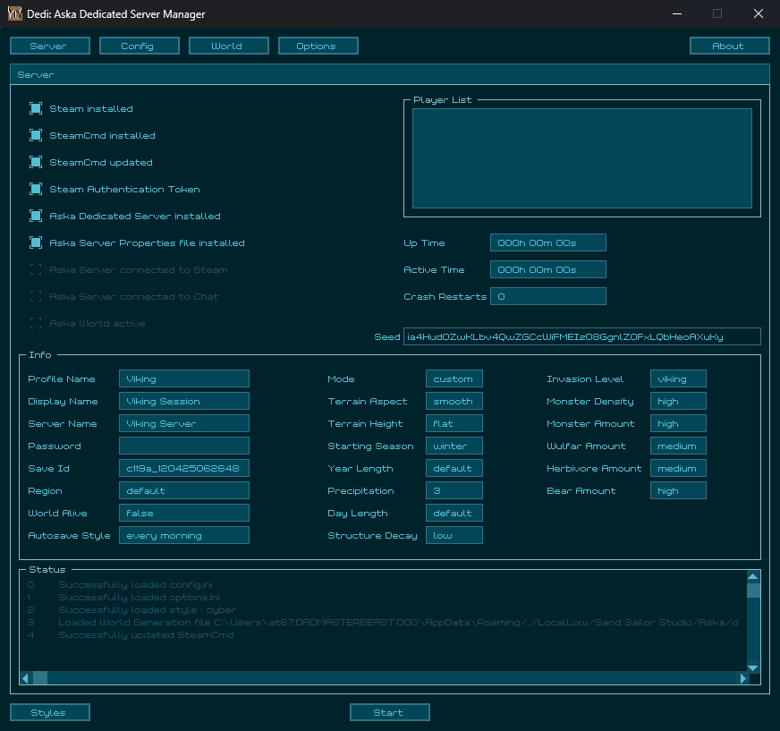

# Dedi
Is a Windows 10/11 only tool that allows for the simple installation, monitoring and control of the Aska Dedicated Server.

## Features
- Open Source: https://github.com/at67/Dedi 
- Simplifies the installation of the server to a couple of mouse clicks. 
- Real-time monitoring of many aspects of the server. 
- Displays Up-Time, Active-Time and the current player list. 
- Has a comprehensive configuration editor for the creation of new servers and maintenance of active servers. 
- Has a world editor for the editing of custom game properties, (for already active servers): see https://worldgen.aska.houseofpain.games as the inspiration for this feature. 
- Has a status display that keeps you constantly informed about the server's health. 
- Is able to restart the server after a server crash or unknown server shutdown. 
- Automatically creates backups of all important files before attempting anything of a serious nature. 
- Creates a backup of your server's save file for every player that logs in to the server, (this allows a simple rollback mechanism for miscreant players). 

## Install
- Download the latest release at: https://github.com/at67/Dedi/releases 
- The zip file should contain one folder and two files:
	- styles, (folder)
	- Dedi.exe, (file)
	- viking.png, (file)
- Create a folder with at least 5 GBytes of free space, (more if you plan on using multiple servers or a large number of backup saves).
- Copy the contents of Dedi.zip into this newly created folder, eg: C:\Dedi 
	C:\Dedi\styles 
	C:\Dedi\Dedi.exe 
	C:\Dedi\viking.png 

## User Guide

TODO:
 
 

## Advanced

TODO:
 
 

### Screenshot

